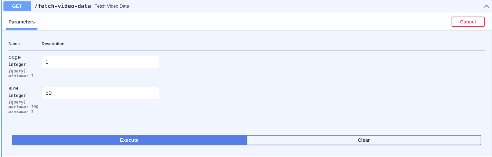
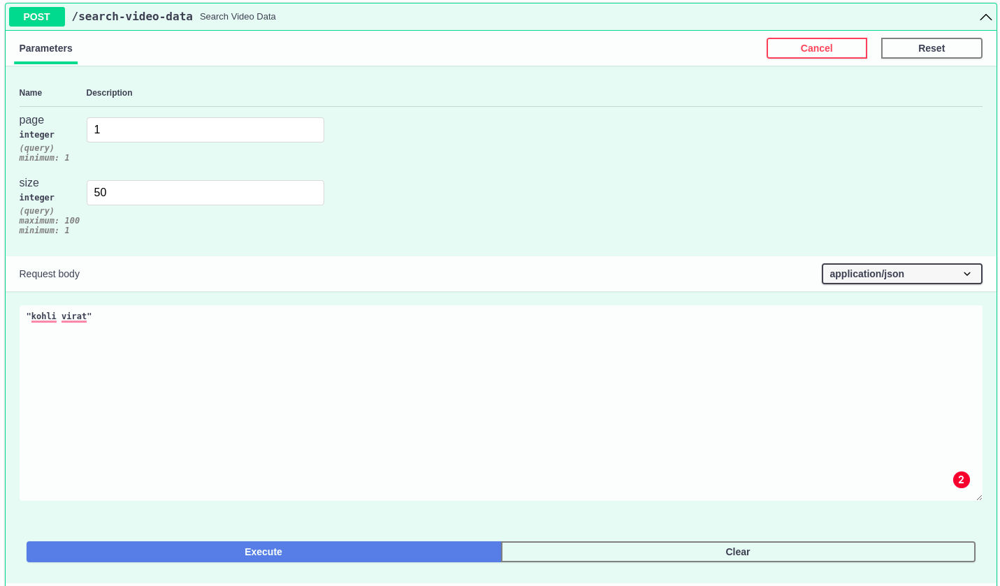

# Search-Video-Data

## Environment Variables

```
MYSQL_USERNAME=root
MYSQL_PASSWORD=
MYSQL_HOSTNAME=localhost
MYSQL_PORT=3306
MYSQL_DBNAME=videoDB
POOL_SIZE=5
MYSQL_TABLENAME=video_data
YT_API_KEY=
```

> Create the `.env` file with the above environment variables.

## How to run?

* **Step-1** <br/>
Clone this repository into your local PC using below command.
```
git clone https://github.com/JeetKaria06/Search-Video-Data.git
```
And `cd` to the directory.

* **Step-2** <br/>
Run the below command to build the image named `video-fetch`.
```
docker build -t video-fetch .
```

* **Step-3** <br/>
Run the below command to run the image created.
```
docker run --env-file <path-to-env-file> --network host video-fetch
```


## API Testing
After going to http://localhost:8000/docs and you will see bunch of API endpoints and their input parameters.

### GET API


Enter the desired values like `page number` in `page` field and `number of records in each page` in `size` field and press execute to get the results.

### Basic Search - POST API

Same way entering values like `page` and `size` field for paginated response. And entering search string in POST body will fetch the results corresponding to the search query and then press execute.
